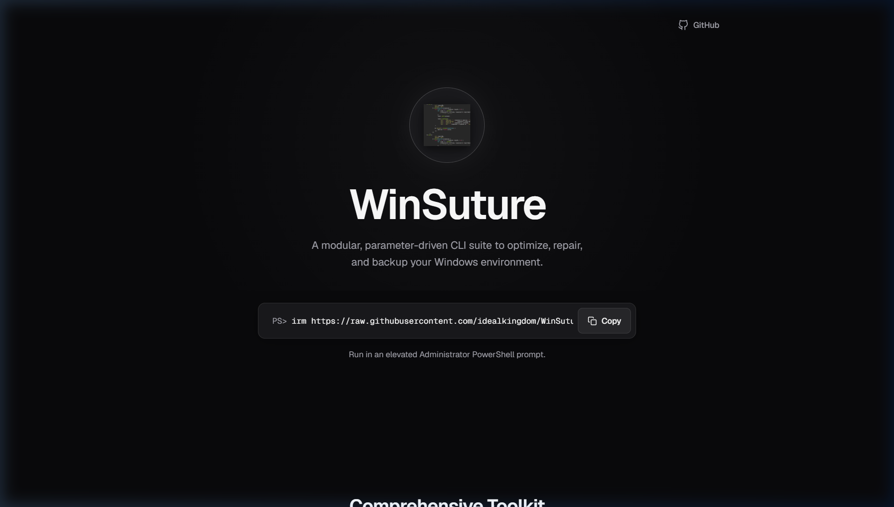
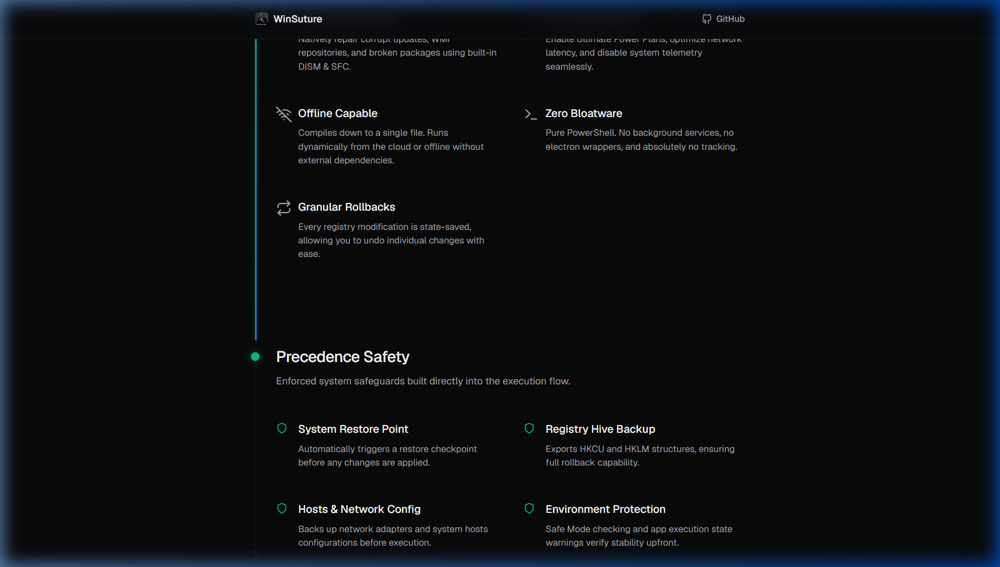
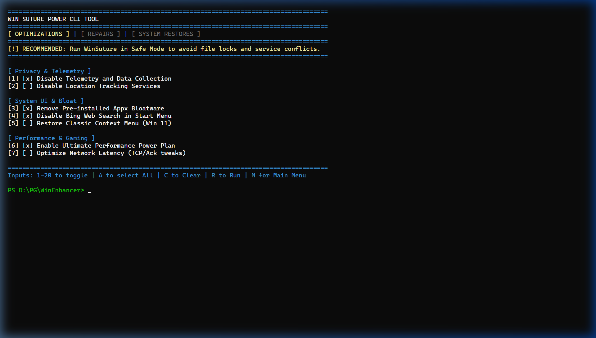

# WinSuture

<p align="center">
  
</p>

**WinSuture** is a modular, zero-bloat CLI suite designed to optimize, repair, and backup Windows environments. 

Rather than relying on heavy executables or background services, WinSuture leverages pure PowerShell to surgically repair system corruption, disable telemetry, and apply advanced system optimizations natively.

---

## ⚡ Core Features

<p align="center">
  
</p>

* **Surgical Precision:** Includes 22 targeted system repairs (leveraging native DISM/SFC logic) and over 20 advanced performance optimizations ranging from network latency tweaks to UI debloating.
* **Granular Rollbacks:** Unlike other tools, WinSuture features an undo engine. Registry modifications are state-saved individually, allowing you to seamlessly revert any specific optimization if needed.
* **Precedence Safety:** Built-in safeguards prompt you to export your registry hives, backup network configurations, and create System Restore points *before* execution begins.
* **Smart Compatibility Scanning:** Automatically checks your OS version and build against each optimization, ensuring that unsupported tweaks are hidden or blocked to prevent system instability.
* **100% Portable & Offline-Capable:** Runs entirely in memory from a single command, or can be downloaded as a ZIP for fully offline execution. Natively checks for local script blocks and seamlessly falls back to cloud fetching if needed.
* **Zero Bloatware:** Pure PowerShell. No installation, no background services, no electron wrappers, and absolutely zero telemetry or tracking. 
* **Tamper Protection:** Every individual script payload is strictly validated against SHA-256 hash manifests before execution to ensure supply-chain integrity.

---

## 🚀 Usage

<p align="center">
  
</p>

### Option 1: Run Online (In-Memory)
Open an **elevated Administrator PowerShell prompt** and run:
```powershell
irm https://raw.githubusercontent.com/idealkingdom/WinSuture/main/WinSuture.ps1 | iex
```

### Option 2: Run Offline
1. Download the [WinSuture.zip](https://github.com/idealkingdom/WinSuture/raw/main/WinSuture.zip) package and extract it.
2. Open an **elevated Administrator PowerShell prompt**.
3. Navigate to the extracted folder and run:
```powershell
Set-ExecutionPolicy Bypass -Scope Process -Force
.\WinSuture.ps1
```

---

## 📂 Architecture

WinSuture dynamically maps tweaks from JSON manifests (`optimizations.json`, `repairs.json`) and executes them in isolated Runspaces. 

For detailed documentation on the individual scripts, mappings, and internal CLI logic, please refer to the [WinSuture Guide](WinSuture_Guide.md).

---

## ⚠️ Disclaimer

**Use at your own risk.** WinSuture modifies core Windows registry keys, services, and system configurations. While it includes built-in undo functionality and prompts for System Restore points, the author is not responsible for any system instability, data loss, or bricked installations that may occur. Always ensure you have a backup of your important files before running any system optimization tool.
